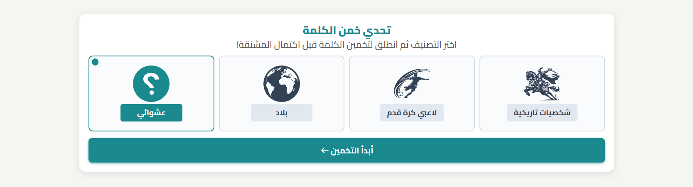
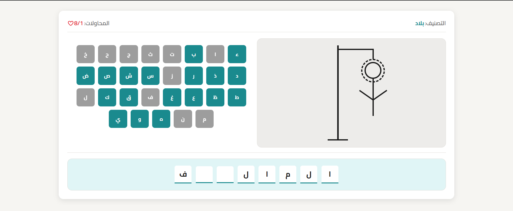

# 🪢 Hangman Game

A responsive Arabic Hangman game built with **HTML5, CSS3, and Vanilla JavaScript (ES Modules)**.

Players choose a category, try to guess the hidden word letter by letter, and receive a personalized result based on their performance.

The game supports Arabic word normalization, keyboard and on-screen input, multiple categories, dynamic word selection, and an accessible RTL interface.

---

## 🎮 Live Demo

🔗 https://basosytech.github.io/Basosy-hangman-game/

---

## ✨ Features

- Multiple word categories
- Dynamic word selection from JSON data
- Arabic RTL interface
- Arabic letter normalization for fairer guessing
- Supports compound words containing spaces
- On-screen Arabic keyboard
- Physical keyboard support
- Keyboard language detection with a helpful Arabic-language hint
- Dynamic hangman drawing using pure CSS
- Maximum attempts derived from the number of hangman parts
- Personalized win/lose messages based on player performance
- Native `<dialog>` elements for result and keyboard-language hints
- Fully keyboard-accessible interface
- ARIA attributes for improved screen-reader support
- SVG sprite for reusable interface icons
- Responsive layout across different screen sizes
- No external JavaScript libraries or frameworks

---

## 🛠 Technologies Used

### HTML5

- Semantic HTML
- `<main>` and `<section>`
- Description lists using `<dl>`, `<dt>`, and `<dd>`
- Native `<dialog>`
- `hidden` attribute
- ARIA attributes
- Inline SVG sprite using `<symbol>` and `<use>`

### CSS3

- CSS Custom Properties
- `clamp()`
- `min()`
- `:has()`
- `:focus-visible`
- CSS animations and transitions
- `@starting-style`
- `allow-discrete`
- Responsive layouts with Flexbox
- Pure CSS hangman illustration

### JavaScript

- Vanilla JavaScript
- ES Modules
- `import ... with { type: "json" }` for JSON data import
- DOM manipulation
- Event Delegation
- `DocumentFragment`
- `Map`
- `replaceChildren()`
- Guard Clauses
- Arabic text normalization
- Native `<dialog>` API

### Data

- JSON-based word database
- Categorized words with descriptions

---

## 🧠 How the Game Works

1. The player selects a category.
2. The corresponding word data is imported from `words.json`.
3. A word is selected from the chosen category.
4. The word is normalized internally to make Arabic letter matching more consistent.
5. The original word is displayed through hidden letter boxes.
6. The player guesses letters using:
   - The on-screen keyboard
   - The physical keyboard
7. Correct guesses reveal the corresponding letters.
8. Incorrect guesses reveal another part of the hangman drawing.
9. The game ends when:
   - All letters have been revealed, or
   - The maximum number of incorrect guesses is reached.
10. A result dialog displays the final outcome and a performance-based message.

---

## 🔤 Arabic Word Normalization

Arabic characters can have multiple written forms that represent closely related characters.

To make guessing more consistent, the game normalizes Arabic text before comparing the player's guess with the target word.

The normalization process includes:

- Converting `أ`, `إ`, and `آ` to `ا`
- Converting `ة` to `ه`
- Converting `ى` to `ي`
- Normalizing `ؤ` and `ئ` to `ء`
- Removing Arabic diacritics and tanween

The normalized version is used internally for comparison, while the original word remains unchanged for display.

This allows the game to compare normalized characters without modifying the actual word shown to the player.

---

## 🗃️ Data Format

Words are stored in a JSON file and organized by category.

Example:

```json
{
  "historical-figures": {
    "title": "شخصيات تاريخية",
    "words": [
      {
        "name": "عمر بن الخطاب",
        "description": "ثاني الخلفاء الراشدين ولقبه الفاروق ومؤسس التقويم الهجري."
      }
    ]
  },

  "football-players": {
    "title": "لاعبي كرة قدم",
    "words": [
      {
        "name": "كريستيانو",
        "description": "أسطورة كرة القدم البرتغالية والهداف التاريخي لريال مدريد والمنتخبات."
      }
    ]
  },

  "countries": {
    "title": "بلاد",
    "words": [
      {
        "name": "مصر",
        "description": "دولة عربية تقع في شمال إفريقيا وتشتهر بالأهرامات ونهر النيل."
      }
    ]
  }
}
```

This data-driven structure allows new categories and words to be added without changing the core game logic.

---

## ⚡ Data Structures & Performance

A `Map` is used to associate each Arabic letter with its corresponding button element.

For example:

```javascript
letterBoxMap.get(letter)
```

This provides average **O(1)** lookup time for retrieving a letter button instead of searching through all buttons on every keyboard interaction.

The map is cleared when a new game starts to remove references associated with the previous game.

The project also uses:

- **Event Delegation** instead of attaching individual click listeners to every letter button.
- **`DocumentFragment`** when generating groups of DOM elements.
- **`replaceChildren()`** when replacing generated content.
- **Cached DOM references** to avoid repeatedly querying the same elements.

These choices keep the implementation simple while avoiding unnecessary DOM work.

---

## ♿ Accessibility

Accessibility was considered as part of the HTML structure rather than being added only through JavaScript.

The project includes:

- Proper document language and direction: `<html lang="ar" dir="rtl">`
- Semantic page structure
- Native `<button>` elements for interactive controls
- Keyboard navigation
- `:focus-visible` styling
- ARIA labels for letter buttons
- `aria-live` for dynamic game updates
- `role="group"` for related letter controls
- `aria-labelledby` for result dialogs
- Native `<dialog>` elements for modal interactions

The goal is to make the game usable with both mouse/touch input and keyboard navigation.

---

## 🎨 Pure CSS Hangman

The hangman illustration is created entirely with CSS rather than using a static image.

Each part of the drawing has its own element and is revealed progressively after incorrect guesses.

The game determines the maximum number of incorrect attempts from the number of drawable hangman parts:

```javascript
maxAttempts: drawElements.length
```

This keeps the game logic connected to the actual number of visual stages rather than hard-coding the number in multiple places.

---

## 🧩 SVG Icon System

The project uses an inline SVG sprite containing reusable SVG symbols.

Icons are defined once as `<symbol>` elements and referenced anywhere using `<use>`:

```html
<svg class="category-icon">
  <use href="#historical-figures-icon"></use>
</svg>
```

This avoids duplicating SVG markup throughout the HTML and allows the icons to be reused and styled through CSS.

---

## 🎯 User Experience Details

Several small interactions were added to make the game more convenient to use:

- Pressing **Enter** can start the game from the start screen.
- Spaces in compound words are automatically recognized rather than requiring the player to guess them.
- The game detects when the physical keyboard is using English letters instead of Arabic input.
- A temporary hint dialog reminds the player to switch the keyboard language.
- Correct and incorrect guesses trigger appropriate sound effects.
- Result messages vary according to the player's performance.
- The result screen provides the final word and game outcome.

---

## 📁 Project Structure

```text
Basosy-hangman-game/
│
├── data/
│   └── words.json
│
├── screenshots/
│   ├── start-screen.png
│   ├── game-screen.png
│   └── result-screen.png
│
├── sounds/
│   ├── success.mp3
│   └── wrong.mp3
│
├── .editorconfig
├── favicon.png
├── favicon.svg
├── index.html
├── main.js
└── master.css
```

---

## 📊 Architecture Overview

| File | Responsibility | Main Concepts |
|---|---|---|
| `index.html` | Page structure and accessible markup | Semantic HTML, ARIA, Dialog, SVG Sprite |
| `master.css` | Visual design and responsive layout | Custom Properties, `clamp()`, `:has()`, animations |
| `main.js` | Game state and game logic | `Map`, Event Delegation, DOM manipulation, normalization |
| `data/words.json` | Word database | Categorized JSON data |
| `sounds/` | Game feedback | Success and error sounds |
| `screenshots/` | Project documentation | Start, game, and result screens |

---

## 🚀 How to Run

1. Clone the repository:

```bash
git clone https://github.com/basosytech/Basosy-hangman-game.git
```

2. Open the project folder.

3. Run the project using a local development server such as **VS Code Live Server**.

> A local server is recommended because the application uses ES Modules with JSON module imports.

---

## 📷 Screenshots

### Start Screen



### Game Screen



### Result Screen


---

## 📄 License

This project is for learning and portfolio purposes.

---

## 👨‍💻 Author

**Abdo (BasosyTech)**

- GitHub: [@BasosyTech](https://github.com/basosytech)
